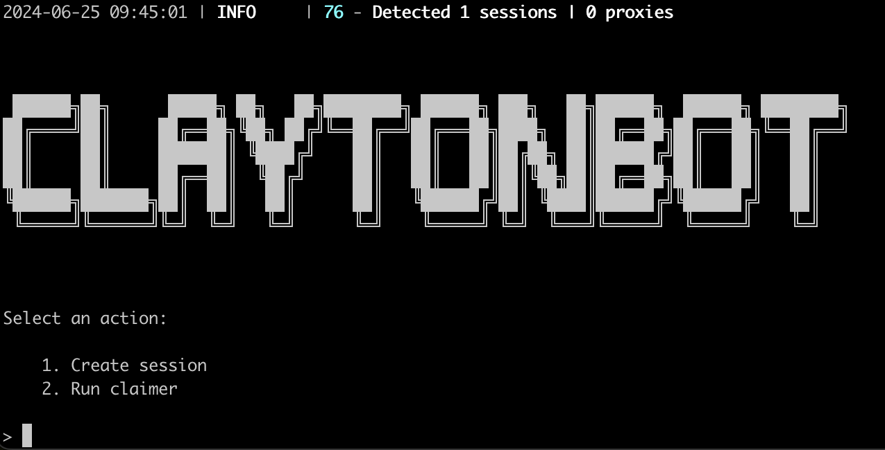

## [Settings](https://github.com/shamhi/PocketFiBot/blob/main/.env-example)
| Настройка               | Описание                                                                   |
|-------------------------|----------------------------------------------------------------------------|
| **API_ID / API_HASH**   | Platform data from which to launch a Telegram session (stock - Android)    |


## Installation
You can download [**Repository**](https://github.com/doubleTroub1e/ClaytonBOT) by cloning it to your system and installing the necessary dependencies:
```shell
~ >>> git clone https://github.com/doubleTroub1e/ClaytonBOT.git
~ >>> cd ClaytonBOT

#Linux
~/ClaytonBOT >>> python3 -m venv venv
~/ClaytonBOT >>> source venv/bin/activate
~/ClaytonBOT >>> pip3 install -r requirements.txt
~/ClaytonBOT >>> cp .env-example .env
~/ClaytonBOT >>> nano .env # Here you must specify your API_ID and API_HASH 
~/ClaytonBOT >>> python3 main.py

#Windows
~/ClaytonBOT >>> python -m venv venv
~/ClaytonBOT >>> venv\Scripts\activate
~/ClaytonBOT >>> pip install -r requirements.txt
~/ClaytonBOT >>> copy .env-example .env
~/ClaytonBOT >>> # Specify your API_ID and API_HASH
~/ClaytonBOT >>> python main.py
```

Also for quick launch you can use arguments, for example:
```shell
~/ClaytonBOT >>> python3 main.py --action (1/2)
# Or
~/ClaytonBOT >>> python3 main.py -a (1/2)

#1 - Create session
#2 - Run clicker
```


## Source code

source code tooked from https://github.com/shamhi/PocketFiBot